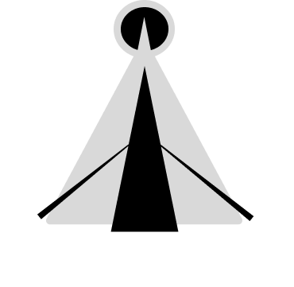

<div align="center">



# Atto4

**The next-generation open-source streaming experience.**
Built for speed, designed for community.

[](https://opensource.org/licenses/MIT)
[](http://makeapullrequest.com)
[](https://nextjs.org/)
[](https://www.typescriptlang.org/)

[Join the Community Discord] | [View Documentation] | [Contribute]

---
</div>

## 👋 Welcome to the Project

Welcome to **Atto4**! We are building a modern, high-performance streaming platform that prioritizes user experience and elegant code.

Atto4 isn't just another streaming site clone. It's an open-source initiative aimed at creating a robust, scalable, and highly customizable streaming engine that anyone can contribute to and learn from. Whether you are a seasoned React veteran or just starting your open-source journey, there is a place for you here.

We believe that the best software is built together.

## ✨ Why Atto4?

We wanted a streaming platform that felt modern, responsive, and wasn't bogged down by legacy code.

* **Community First:** Decisions are driven by community needs and contributor input.
* **Modern Stack:** Built on the bleeding edge with Next.js App Router and TypeScript for a type-safe, lightning-fast experience.
* **Sleek UI/UX:** A focus on minimalist design and intuitive navigation.
* **Custom Player:** (In progress) A bespoke video player experience designed specifically for Atto4.

## 🛠️ The Tech Stack

We use the best modern tools available to ensure a great developer experience (DX) and user experience (UX).

* **Framework:** [Next.js 14/15 (App Router)](https://nextjs.org/)
* **Language:** [TypeScript](https://www.typescriptlang.org/)
* **Styling:** [Tailwind CSS](https://tailwindcss.com/) (Assumed based on modern standards)
* **Package Manager:** [pnpm](https://pnpm.io/)
* **Linting:** ESLint

## 🚀 Getting Started

Ready to dive into the code? Setting up Atto4 locally is easy.

**Prerequisites:**
* Node.js (LTS version recommended)
* pnpm installed globally (`npm install -g pnpm`)

**Steps:**

1.  **Fork and Clone the repository:**
    ```bash
    git clone [https://github.com/YOUR-USERNAME/atto4.git](https://github.com/YOUR-USERNAME/atto4.git)
    cd atto4
    ```

2.  **Install dependencies:**
    We use `pnpm` for fast, reliable installs.
    ```bash
    pnpm install
    ```

3.  **Set up environment variables:**
    Copy the example env file to a local one.
    ```bash
    cp .env.local.example .env.local
    # Open .env.local and fill in necessary API keys (if any are currently required)
    ```

4.  **Run the development server:**
    ```bash
    pnpm dev
    ```

Open [http://localhost:3000](http://localhost:3000) with your browser to see the result!

## 🤝 How to Contribute

We **love** contributions! This project thrives on community involvement. You don't need to be a 10x engineer to help; we appreciate all kinds of contributions.

### Ways you can help right now:

* **🐛 Squash Bugs:** Check the "Issues" tab for bugs reported by users.
* **✨ New Features:** Look for issues labeled `enhancement` or `help wanted`.
* **🎨 Design & UI:** Help us polish the interface or design new components.
* **📝 Documentation:** Improve this README, write docs for components, or create tutorials.
* **🗣️ Discussion:** Join our Discord and participate in architectural discussions.

### Contribution Guidelines

Please take a moment to review our `CONTRIBUTING.md` (Coming Soon!) for details on our code style, pull request process, and community standards.

> **Note for new contributors:** If you're looking for a good first issue, filter the issues tab by the label `good first issue`. These are designed to be approachable introductions to the codebase.

## 🗺️ Roadmap & Vision

We are currently in the early stages of development. Here is a high-level view of where we are headed:

* [x] Initial Next.js App Router setup.
* [ ] Basic routing and layout structure.
* [ ] Implementation of the custom Atto4 Player.
* [ ] User authentication system.
* [ ] Backend integration for media catalog.
* [ ] Community theming support.

## 💬 Join the Conversation

The heart of Atto4 is its community.

* **Discord:** [Link to your Discord Server] - For quick chats, brainstorming, and hanging out.
* **GitHub Discussions:** For deeper technical debates and feature proposals.

***

<div align="center">
Made with ❤️ by the Atto4 Community.
</div>
